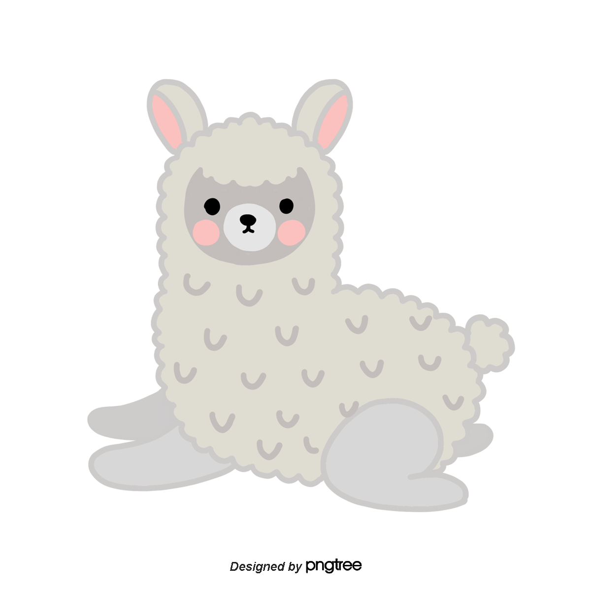

# What are toy programs?

Toy programs are small computer program used for educational purposes. The
concepts implemented can be useful in more sophisticated programs. A toy
program typically focuses on a specific problem, such as computing the Nth
term in a sequence. - Wiki 

For more on toy programs [click here](https://en.wikipedia.org/wiki/Toy_program)
Alpaca png source [click here](https://pngtree.com/freepng/gray-cute-illustration-hand-painted-alpaca_3839821.html)

## Credits
This is a work in process owned by Angel Li [@angelptli](https://github.com/angelptli)